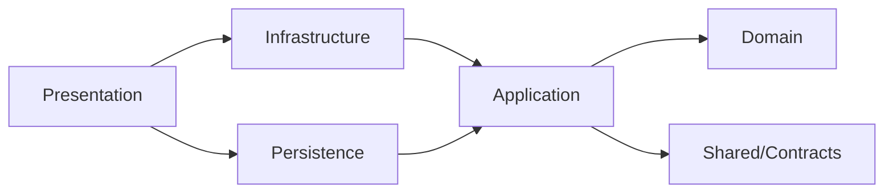
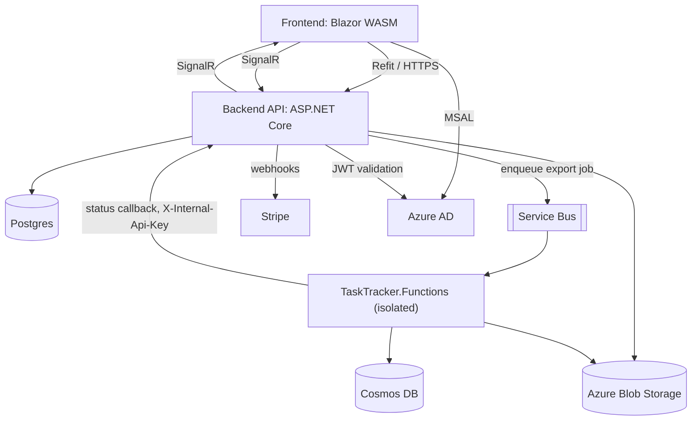
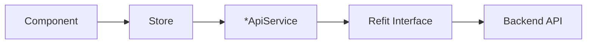

# Architecture Spine — TaskTracker

## Design Paradigm

**Backend:** Clean Architecture with CQRS (MediatR). Layers map directly to projects/namespaces:
`Domain` (entities, invariants, exceptions — no dependencies) → `Application` (use cases as CQRS commands/queries, depends only on `Domain` + `Shared/Contracts`) → `Infrastructure`/`Persistence` (adapters: EF Core, Azure SDKs, Stripe, SignalR hubs) → `Presentation` (ASP.NET Core host, thin controllers).

**Frontend:** A mirrored adapter chain rather than a different paradigm: `Component`/`Page` → `Store` (state + orchestration) → `*ApiService` (unwraps Refit responses) → Refit interface → Backend API. Components never skip a layer.

**Microservice:** `TaskTracker.Functions` is intentionally decoupled from the main API's DI graph — its own `Program.cs`, triggered by Service Bus, not a shared-process extension of the backend.

## Invariants & Rules



### AD-1 — Backend dependency direction [ADOPTED]

- **Binds:** all Backend projects (Domain, Application, Infrastructure, Persistence, Presentation)
- **Prevents:** circular references, business logic leaking into Presentation/Infrastructure, Domain acquiring a dependency
- **Rule:** dependencies flow one way — Presentation → Infrastructure/Persistence → Application → Domain. Domain depends on nothing. Application depends only on Domain and Shared/Contracts. Controllers dispatch `IRequest`s via MediatR only; no business logic in controller actions.

### AD-2 — CQRS shape and pipeline order [ADOPTED]

- **Binds:** all Application commands/queries
- **Prevents:** validation/logging/entitlement checks applied inconsistently per feature; handler logic scattered across files
- **Rule:** one file per command/query under `Application/Features/<Feature>/{Commands,Queries}`, containing the record, its `IRequestHandler`, and its FluentValidation validator together. The MediatR pipeline order is fixed: `ValidationBehavior` → `LoggingBehavior` → `WorkspaceFeatureGuardBehavior`.

### AD-3 — Shared/Contracts is the sole wire-format authority [ADOPTED]

- **Binds:** all DTOs, request models, enums, and SignalR notification payloads exchanged between Backend and Frontend
- **Prevents:** Backend and Frontend independently defining diverging shapes for the same wire data
- **Rule:** any type that crosses the Backend/Frontend boundary is defined once in `src/Shared/Contracts` and referenced by both sides. A contract change requires checking both Backend Application handlers and Frontend Refit interfaces/Stores before merging.

### AD-4 — Entitlement checks are call-site checks today, not automatic

- **Binds:** any command/query or UI feature gated by workspace subscription plan
- **Prevents:** a third, different gating pattern emerging on top of the two that already coexist; a feature enforced on only one side (backend rejects but UI still shows it enabled, or UI hides it but backend has no guard)
- **Rule:** every gated feature today calls `IEntitlementService.HasFeatureAsync(workspaceId, feature, ct)` explicitly inside the handler at the point of use, then throws `SubscriptionFeatureRequiredException` itself (see `ArchiveAndExportCommand`, `ReExportArchivedBoardCommand`, `GetBoardArchiveDownloadQuery`). A separate mechanism also exists in the codebase — `IRequireWorkspaceFeature` + `WorkspaceFeatureGuardBehavior`, which would enforce this automatically via the MediatR pipeline — but **no handler implements it**; it is dead code as of this writing. New gated features must follow the call-site pattern (the 3 real precedents), not the unused pipeline interface, until the team consolidates on one. The frontend mirrors gating via `WorkspaceSubscriptionsStore` for visual gating only, regardless of which backend mechanism is used — adding a new gated feature still means updating both sides together.

### AD-5 — Database schema authority is DbUp, not EF migrations [ADOPTED]

- **Binds:** all Postgres schema changes
- **Prevents:** EF Core's model and DbUp scripts becoming two competing sources of schema truth
- **Rule:** a schema change requires both a `Persistence/Configurations/*` `IEntityTypeConfiguration` update (for querying) and a new numbered `Database/Scripts/000N_*.sql` (the actual schema authority, applied by the `db-migration` container). EF Core migrations are never generated or applied at runtime.

### AD-6 — Error contract chain [ADOPTED]

- **Binds:** all business-rule violations raised from Application/Domain
- **Prevents:** ad hoc error shapes per endpoint; leaking internal exception detail to clients
- **Rule:** business-rule violations throw a `Domain.Exceptions.AppException` subtype (abstract base carrying `StatusCode` + `Title`, concrete subtypes via primary constructors). `Presentation/Infrastructure/GlobalExceptionHandler` (an `IExceptionHandler`) is the single place that catches these and renders `ProblemDetails`; no per-controller try/catch. `KeyNotFoundException`/`UnauthorizedAccessException`/`InvalidOperationException` are legacy-only fallbacks — new code adds an `AppException` subtype instead. On the frontend, `ApiResponseExtensions.HandleResponseAsync()` extracts the message from `ProblemDetails` (`Errors` → `Detail` → `Title` → raw content → generic fallback) and throws an untyped `Exception` — the frontend does not receive a typed/structured error even though the backend raises one. **Known gap:** this chain covers HTTP endpoints only — SignalR hubs (e.g. `BoardExportStatusHub`) throw raw exceptions that SignalR wraps as a client-side `HubException`, bypassing `GlobalExceptionHandler` entirely. Don't assume hub methods get the same `ProblemDetails` treatment as controller actions.

### AD-7 — Resource-scoped authorization is explicit, not automatic

- **Binds:** every handler operating on a Workspace- or Board-scoped resource
- **Prevents:** a new handler silently skipping membership/role authorization — this is the one access-control layer in the system that is **not** enforced structurally
- **Rule:** a handler must call the matching access-check service explicitly as its first action — there are two, intentionally distinct: `IWorkspaceAccessService.EnsureIsMemberAsync` for workspace-level operations (e.g. `GetWorkspaceByIdQueryHandler`), and `IBoardAccessService` for board/column/task/comment/attachment-level operations, which covers the larger share of handlers. Neither is enforced by a pipeline behavior — a reviewer must check for the call, an agent must not assume either happens automatically. Board access is not derived from workspace membership automatically; nothing today reconciles the two if one changes (see Deferred).

### AD-8 — Async work split: Hangfire orchestrates, Functions does the heavy processing

- **Binds:** any new scheduled/recurring or heavy async workload
- **Prevents:** heavy archive-building processing being duplicated inside a Hangfire job, or a third async mechanism appearing per feature
- **Rule:** Hangfire (`Hangfire.PostgreSql` storage, hosted in the API) runs `BoardExportSchedulerJob`/`BoardExportRecoverySchedulerJob`, which scan for pending export requests, mutate export status, and enqueue onto Service Bus — this is in-process orchestration, not a bare trigger. The isolated `TaskTracker.Functions` microservice does the actual heavy work (archive building, blob upload) once triggered by the Service Bus message, and reports status back to the API over HTTP (guarded by `InternalApiKeyMiddleware` under `/api/internal`) for relay to clients via SignalR. **Known gap:** the scheduler job runs with `AutomaticRetry(Attempts=0)`, and neither it nor the Functions message handler has idempotency/dedup protection today — a retry or duplicate delivery can replay side effects. New async work must not assume retry-safety without adding it explicitly.

### AD-9 — Frontend call chain is fixed

- **Binds:** all Frontend API access and cross-component state
- **Prevents:** components bypassing the Store to call a Refit interface or `*ApiService` directly; state duplicated per-component instead of shared
- **Rule:** Refit interface (`Services/Api`) → `*ApiService` (unwraps via `response.HandleResponseAsync()`) → `Store` (`Services/<Feature>/Stores`, scoped, holds/publishes state) → components/pages. Components/pages inject the Store only — confirmed as the intended convention by the project owner, not just inferred from the majority of the code.
- **Known violations (migration debt, not a second accepted pattern):** `WorkspaceSubscription.razor`, `WorkspaceActiveBoards.razor`, and `BoardExportControls.razor` currently inject an `*ApiService` directly, bypassing the Store. New code must follow the Store-only rule regardless.

## Consistency Conventions

| Concern | Convention |
| --- | --- |
| Naming (entities, files, interfaces, events) | File-scoped namespaces; one command/query/config/repository/module/controller per file, feature-foldered. Private fields `_camelCase`, parameters `camelCase` (build-error enforced). DTOs/Contracts are `record` types with primary constructors. |
| Data & formats (ids, dates, error shapes, envelopes) | IDs are `Guid`. Errors are RFC7807 `ProblemDetails` (`StatusCode`/`Title`/`Detail`, plus `errors` extension for validation). SignalR notification payloads live in `Shared/Contracts/Notifications/{BoardActions,BoardExport}`. |
| State & cross-cutting (mutation, errors, logging, config, auth) | Cross-cutting concerns are MediatR pipeline behaviors (`ValidationBehavior`, `LoggingBehavior`, `WorkspaceFeatureGuardBehavior`), fixed order. Sensitive fields (`Password`, `Token`, `RefreshToken`, `ClientSecret`, `AccessToken`) are redacted from Serilog output by exact property name (known gap: other secret-bearing names are not covered). Auth is Azure AD end-to-end (Microsoft.Identity.Web backend, MSAL frontend). Internal service-to-service calls (Functions → API) go through `/api/internal` guarded by a static `X-Internal-Api-Key` header. |

## Stack

| Name | Version |
| --- | --- |
| .NET | 10 (`net10.0`) |
| ASP.NET Core Web API | 10 |
| Blazor WebAssembly + MudBlazor | 10 / 9.5.0 |
| EF Core + Npgsql | 10.0.8 / 10.0.2 (query only, see AD-5) |
| MediatR | 14.1.0 |
| FluentValidation | 12.1.1 |
| Postgres | 17-alpine |
| Hangfire + Hangfire.PostgreSql | 1.8.23 / 1.21.1 |
| Azure Functions Worker (isolated, V4) | 2.52.0 |
| Azure Service Bus | 7.20.1 |
| Azure Cosmos DB | 3.61.0 |
| Azure Blob Storage (Azurite locally) | 12.27.0–12.29.1 |
| Microsoft.Identity.Web / MSAL WebAssembly | 4.10.0 / 10.0.8 |
| Stripe.net | 52.1.1 |
| Serilog + Serilog.AspNetCore | 4.3.0 / 10.0.0 |

## Structural Seed





**Current environment envelope:** local development only, via Docker Compose (`postgres-db`, `db-migration`, `azurite`, `api`, `functions`, `frontend`) or a hybrid mode running API/Frontend natively against dockerized infra. No staging/production topology exists yet (see Deferred).

```text
src/
  Backend/
    Domain/           # entities, exceptions, enums — no dependencies
    Application/       # CQRS features, behaviors, interfaces
    Infrastructure/     # Azure AD, Blob, SignalR hubs, Hangfire jobs, Stripe/subscriptions
    Persistence/        # EF Core DbContext, Configurations, Repositories, UnitOfWork
    Presentation/        # controllers, global exception handling, Program.cs
    Database/            # DbUp console app + numbered SQL scripts (schema authority)
  Frontend/
    Domain/               # frontend-side models
    Services.Abstractions/ # API service + Store interfaces
    Services/              # Refit clients, ApiServices, Stores, SignalR hub services
    WebApp/                 # Blazor WASM host: Pages, Components, Shared
  Shared/
    Contracts/                # DTOs, requests, enums, SignalR notification payloads
  Microservices/
    TaskTracker.Functions/     # isolated Azure Functions: export trigger, processing, archiving
```

## Deferred

- **WebRTC calls (signaling/session-state ownership) — highest priority to revisit:** no code exists yet, but `feature/webrtc-calls` is the *current active branch*. Whether calls are ephemeral (SignalR-only, no persistence) or backed by a Postgres session entity is unresolved — deferred at the user's request, but this is the one deferred item most likely to cause real divergence if work starts on this branch before it's decided (frontend and backend could each build a spine-compliant half that can't integrate). Revisit before writing any WebRTC code.
- **Production deployment topology:** no CI/CD (`.github`) or IaC (Bicep/Terraform) exists in the repo — only local Docker Compose. Hosting model, environments, and release pipeline are undecided; do not invent one.
- **Consolidate the two competing entitlement-gating mechanisms (AD-4):** call-site `IEntitlementService.HasFeatureAsync` (used by all 3 real gated features) vs. the unused `IRequireWorkspaceFeature`/`WorkspaceFeatureGuardBehavior` pipeline (dead code today). Pick one and migrate the other away rather than letting both linger.
- **Reconcile board-level and workspace-level authorization (AD-7):** `IBoardAccessService` and `IWorkspaceAccessService` are separate, purpose-built checks with no automatic sync — e.g. no automatic revocation of board access when workspace membership changes. Not yet decided whether this needs an explicit reconciliation mechanism.
- **Migrate AD-9 violations:** `WorkspaceSubscription.razor`, `WorkspaceActiveBoards.razor`, `BoardExportControls.razor` onto their Store instead of injecting `*ApiService` directly.
- **Observability/tracing strategy is inconsistent across services:** `TaskTracker.Functions` has OpenTelemetry instrumentation; the Backend API does not. Not yet decided whether/how to unify — flagging rather than letting it silently diverge further as more services are added.
